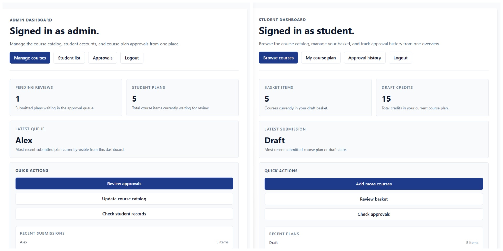
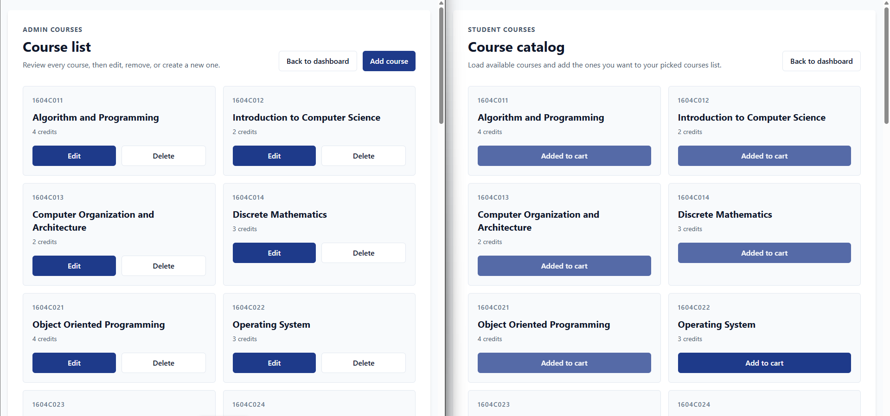
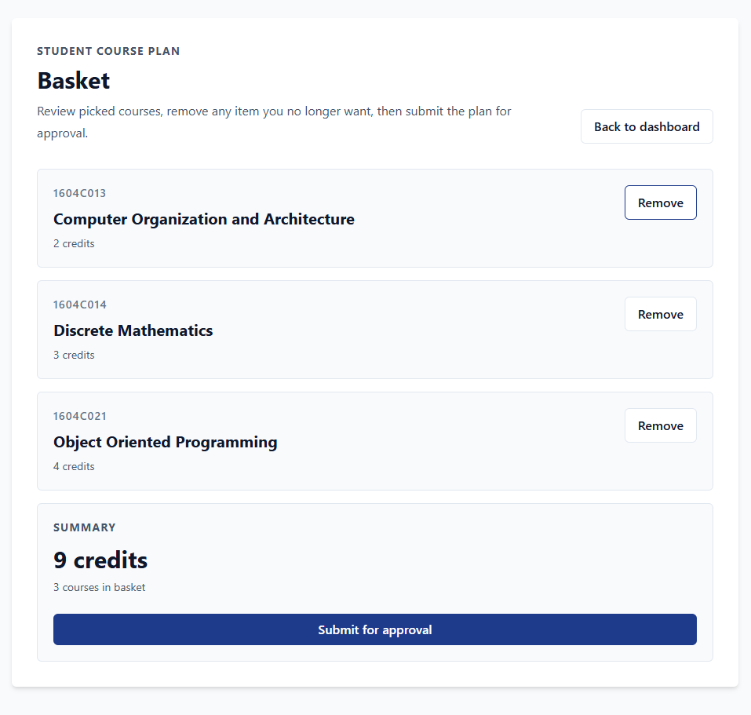
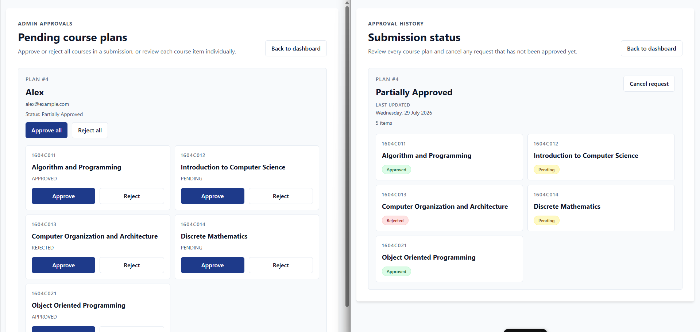
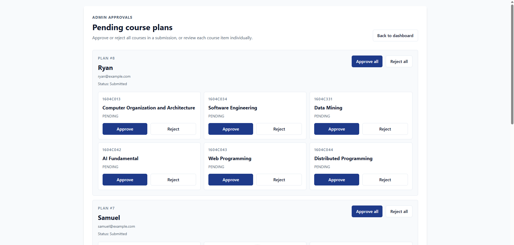
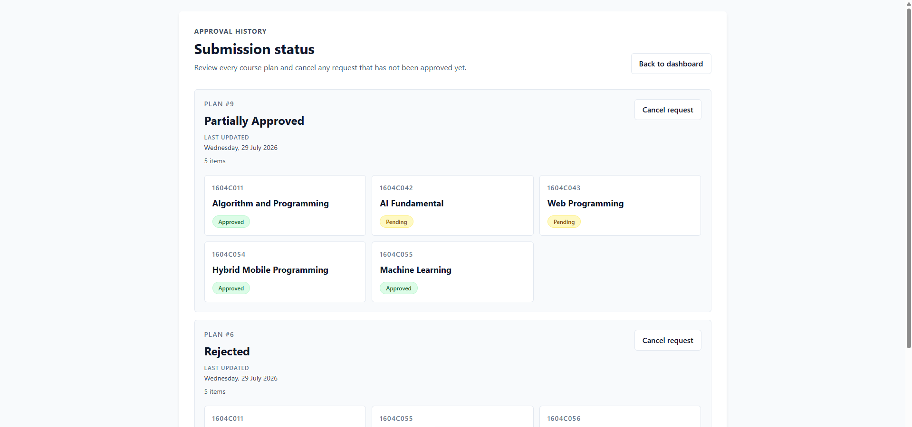
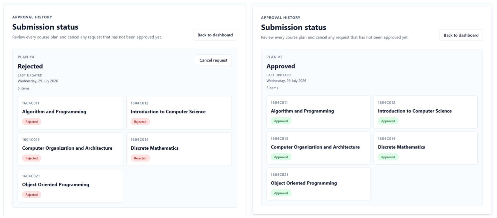

<header id="readme-top">
  <div align="center">
    
    <h1>CourseEnrollment*</h1>
    <p><i>*The name is used solely as a project identifier. Any resemblance to existing names, trademarks, brands, or copyrighted works is unintentional. All rights remain with their respective owners.</i></p>
    <p>A simple app for learning Go and Nuxt.</p>
    <p>
      CourseEnrollment is a course planning and enrollment practice project built to explore a Go API, a Nuxt frontend, Redis caching, and JWT-based authentication.
    </p>
    <a href="#installation">Installation</a>
    &middot;
    <a href="#commands">Commands</a>
    &middot;
    <a href="#demo">Demo</a>
    &middot;
    <a href="#api">API</a>
    <br><br>
    
    
    
    
    
  </div>
</header>

<hr>

<details>
  <summary>Table of Contents</summary>
  <ol>
    <li><a href="#overview">Overview</a></li>
    <li><a href="#structure">Structure</a></li>
    <li><a href="#prerequisites">Prerequisites</a></li>
    <li><a href="#installation">Installation</a></li>
    <li><a href="#usage">Usage</a></li>
    <li><a href="#commands">Commands</a></li>
    <li><a href="#demo">Demo</a></li>
    <li><a href="#api">API</a></li>
    <li><a href="#license">License</a></li>
  </ol>
</details>

<section id="overview">
  <header>
    <h2>Overview</h2>
  </header>
  <p>
    CourseEnrollment is a compact learning project for practicing full-stack development with Go and Nuxt. It focuses on the core flow of browsing courses, building a course plan, and handling role-based access for students and administrators.
  </p>
  <p>
    The backend uses Gin, Redis, and JWT to keep the API fast and secure, while the frontend uses Nuxt to present a clean interface for course management and enrollment workflows.
  </p>
  <p align="right"><a href="#readme-top">Back to top</a></p>
</section>

<br>

<a id="structure"></a>

## Structure

<pre><code>CourseEnrollment/
├── frontend/
│   ├── app/
│   │   ├── components/    # Reusable UI components
│   │   ├── layouts/       # Nuxt layouts
│   │   ├── middleware/    # Route guards
│   │   ├── pages/         # Application pages
│   │   ├── plugins/       # Nuxt plugins
│   │   ├── services/      # Client-side API wrappers
│   │   └── utils/         # Frontend helpers
│   ├── public/            # Static assets
│   └── nuxt.config.ts     # Nuxt configuration
├── endpoint/
│   ├── controllers/       # HTTP handlers
│   ├── middleware/        # Gin middleware
│   ├── models/            # Domain models
│   ├── repositories/      # Data access and caching
│   ├── routes/            # Route definitions
│   └── services/          # Business logic
├── database/              # SQL schema and sample data
└── README.md</code></pre>
<p>
  The project keeps the frontend and backend separated so each side can be developed independently while still sharing the same course enrollment domain.
</p>
<p align="right"><a href="#readme-top">Back to top</a></p>

<br>

<section id="prerequisites">
 <header>
    <h2>Prerequisites</h2>
  </header>
  <table>
    <thead>
      <tr>
        <th>Component</th>
        <th>Requirements</th>
      </tr>
    </thead>
    <tbody>
      <tr>
        <td><strong>Frontend</strong></td>
        <td>
          <ul>
            <li>Node.js 20 or newer</li>
            <li>pnpm, npm, or yarn</li>
            <li>VS Code or another editor with Nuxt support</li>
          </ul>
        </td>
      </tr>
      <tr>
        <td><strong>Backend API</strong></td>
        <td>
          <ul>
            <li>Go 1.22 or newer</li>
            <li>MySQL 8 or compatible database</li>
            <li>Redis</li>
          </ul>
        </td>
      </tr>
    </tbody>
  </table>
  <p align="right"><a href="#readme-top">Back to top</a></p>
</section>

<br>

<a id="installation"></a>

## Installation

This project consists of two main components:

- **Nuxt Frontend**
- **Go REST API**

---

### Frontend

1. Clone the repository.

```sh
git clone <REPOSITORY_URL>
cd CourseEnrollment
```

2. Navigate to the frontend project.

```sh
cd frontend
```

3. Install dependencies.

```sh
pnpm install
```

4. Configure the API endpoint.

Update the base URL in the Nuxt API client to point to your backend.

Example:

```ts
const baseUrl = "http://localhost:8080";
```

5. Run the application.

```sh
pnpm dev
```

---

### Backend API

The backend is a Go service built with Gin and backed by Redis for caching.

#### Prerequisites

- Go 1.22+
- MySQL
- Redis

#### Start the backend

Navigate to the backend directory.

```sh
cd endpoint
```

Install dependencies and start the API.

```sh
go mod tidy
go run main.go
```

This will start the Go API and connect it to the configured database and Redis instance.

It covers:

- Gin HTTP server
- MySQL persistence
- Redis cache

The API will be available at

```text
http://localhost:8080
```

The frontend can then consume the same base URL from the Nuxt client.

<p align="right"><a href="#readme-top">Back to top</a></p>

<br>

<section id="usage">
  <header>
    <h2>Usage</h2>
  </header>
  <ul>
    <li>Create an account or log in to access role-based dashboards.</li>
    <li>Browse courses and inspect available course details.</li>
    <li>Build a course plan by selecting the courses you want to take.</li>
    <li>Let administrators review, approve, or manage submitted plans.</li>
    <li>Use the project as a reference for Go, Nuxt, Redis, and JWT integration.</li>
  </ul>
  <p align="right"><a href="#readme-top">Back to top</a></p>
</section>

<br>

<section id="commands">
  <header>
    <h2>Commands</h2>
  </header>
  <table>
    <thead>
      <tr>
        <th>Command</th>
        <th>Description</th>
      </tr>
    </thead>
    <tbody>
      <tr>
        <td><code>pnpm install</code></td>
        <td>Install frontend dependencies.</td>
      </tr>
      <tr>
        <td><code>pnpm dev</code></td>
        <td>Run the Nuxt frontend in development mode.</td>
      </tr>
      <tr>
        <td><code>go run main.go</code></td>
        <td>Start the Go backend API.</td>
      </tr>
      <tr>
        <td><code>go test ./...</code></td>
        <td>Run backend tests, if present.</td>
      </tr>
    </tbody>
  </table>
  <p align="right"><a href="#readme-top">Back to top</a></p>
</section>

<br>

<section id="demo">
  <header>
    <h2>Demo</h2>
  </header>

  <p align="center">
    
  </p>

  <p align="center">
    Admin and student dashboard overview
  </p>

  <br>

  <p align="center">
    
  </p>

  <p align="center">
    Course list and course browsing
  </p>

  <br />

  <p align="center">
    
  </p>

  <p align="center">
    Student course plan draft
  </p>

  <br />

  <p align="center">
    
  </p>

  <p align="center">
    Admin review and approval
  </p>

  <br />

  <p align="center">
    
  </p>

  <p align="center">
    Approval detail view
  </p>

  <br />

  <p align="center">
    
  </p>

  <p align="center">
    Student course plan history
  </p>

  <br />

  <p align="center">
    
  </p>

  <p align="center">
    Additional project screen
  </p>

  <br />

  <p align="right">
    <a href="#readme-top">Back to top</a>
  </p>
</section>

<br>

<section id="api">
  <header>
    <h2>API</h2>
  </header>
  <p>The backend API supports authentication, course management, course-plan workflows, and student approvals. It is organized around Go handlers and protected routes for a straightforward local setup.</p>

  <table>
    <thead>
      <tr>
        <th>Title</th>
        <th>Method</th>
        <th>Auth</th>
        <th>RBAC</th>
        <th>Description</th>
      </tr>
    </thead>
    <tbody>
      <tr>
        <td><code>/auth/login</code></td>
        <td>POST</td>
        <td>No</td>
        <td>Public</td>
        <td>Authenticate user and retrieve JWT token.</td>
      </tr>
      <tr>
        <td><code>/auth/register</code></td>
        <td>POST</td>
        <td>No</td>
        <td>Public</td>
        <td>Create a new student account.</td>
      </tr>
      <tr>
        <td><code>/users</code></td>
        <td>GET</td>
        <td>Yes</td>
        <td>Authenticated</td>
        <td>Retrieve all users.</td>
      </tr>
      <tr>
        <td><code>/users/:id</code></td>
        <td>GET</td>
        <td>Yes</td>
        <td>Authenticated</td>
        <td>Retrieve a user by ID.</td>
      </tr>
      <tr>
        <td><code>/users</code></td>
        <td>POST</td>
        <td>Yes</td>
        <td>Authenticated</td>
        <td>Create a user.</td>
      </tr>
      <tr>
        <td><code>/users/:id</code></td>
        <td>PUT</td>
        <td>Yes</td>
        <td>Authenticated</td>
        <td>Update user profile details.</td>
      </tr>
      <tr>
        <td><code>/users/:id</code></td>
        <td>DELETE</td>
        <td>Yes</td>
        <td>Authenticated</td>
        <td>Delete a user account.</td>
      </tr>
      <tr>
        <td><code>/courses</code></td>
        <td>GET</td>
        <td>Yes</td>
        <td>Authenticated</td>
        <td>Retrieve all available courses.</td>
      </tr>
      <tr>
        <td><code>/courses/:id</code></td>
        <td>GET</td>
        <td>Yes</td>
        <td>Authenticated</td>
        <td>Retrieve details for a specific course.</td>
      </tr>
      <tr>
        <td><code>/admin/courses</code></td>
        <td>POST</td>
        <td>Yes</td>
        <td>Admin only</td>
        <td>Create a new course entry.</td>
      </tr>
      <tr>
        <td><code>/admin/courses/:id</code></td>
        <td>PUT</td>
        <td>Yes</td>
        <td>Admin only</td>
        <td>Update an existing course.</td>
      </tr>
      <tr>
        <td><code>/admin/courses/:id</code></td>
        <td>DELETE</td>
        <td>Yes</td>
        <td>Admin only</td>
        <td>Delete a course.</td>
      </tr>
      <tr>
        <td><code>/admin/students</code></td>
        <td>GET</td>
        <td>Yes</td>
        <td>Admin only</td>
        <td>Retrieve all students for admin management.</td>
      </tr>
      <tr>
        <td><code>/admin/students/:id</code></td>
        <td>GET</td>
        <td>Yes</td>
        <td>Admin only</td>
        <td>Retrieve a student by ID for admin management.</td>
      </tr>
      <tr>
        <td><code>/admin/students</code></td>
        <td>POST</td>
        <td>Yes</td>
        <td>Admin only</td>
        <td>Create a student record from the admin panel.</td>
      </tr>
      <tr>
        <td><code>/admin/students/:id</code></td>
        <td>PUT</td>
        <td>Yes</td>
        <td>Admin only</td>
        <td>Update a student record from the admin panel.</td>
      </tr>
      <tr>
        <td><code>/admin/students/:id</code></td>
        <td>DELETE</td>
        <td>Yes</td>
        <td>Admin only</td>
        <td>Delete a student record from the admin panel.</td>
      </tr>
      <tr>
        <td><code>/admin/courses</code></td>
        <td>GET</td>
        <td>Yes</td>
        <td>Admin only</td>
        <td>Retrieve all courses for admin management.</td>
      </tr>
      <tr>
        <td><code>/admin/courses/:id</code></td>
        <td>GET</td>
        <td>Yes</td>
        <td>Admin only</td>
        <td>Retrieve a course by ID for admin management.</td>
      </tr>
      <tr>
        <td><code>/admin/courses</code></td>
        <td>POST</td>
        <td>Yes</td>
        <td>Admin only</td>
        <td>Create a course from the admin panel.</td>
      </tr>
      <tr>
        <td><code>/admin/courses/:id</code></td>
        <td>PUT</td>
        <td>Yes</td>
        <td>Admin only</td>
        <td>Update a course from the admin panel.</td>
      </tr>
      <tr>
        <td><code>/admin/courses/:id</code></td>
        <td>DELETE</td>
        <td>Yes</td>
        <td>Admin only</td>
        <td>Delete a course from the admin panel.</td>
      </tr>
      <tr>
        <td><code>/admin/course-plans</code></td>
        <td>GET</td>
        <td>Yes</td>
        <td>Admin only</td>
        <td>Retrieve all course plans for admin review.</td>
      </tr>
      <tr>
        <td><code>/admin/course-plans/:id/review</code></td>
        <td>PUT</td>
        <td>Yes</td>
        <td>Admin only</td>
        <td>Review a course plan and update its status.</td>
      </tr>
      <tr>
        <td><code>/coursePlans</code></td>
        <td>GET</td>
        <td>Yes</td>
        <td>Authenticated</td>
        <td>Retrieve all course plans.</td>
      </tr>
      <tr>
        <td><code>/coursePlans/:id</code></td>
        <td>GET</td>
        <td>Yes</td>
        <td>Authenticated</td>
        <td>Retrieve a course plan by ID.</td>
      </tr>
      <tr>
        <td><code>/coursePlans</code></td>
        <td>POST</td>
        <td>Yes</td>
        <td>Authenticated</td>
        <td>Create a course plan.</td>
      </tr>
      <tr>
        <td><code>/coursePlans/:id</code></td>
        <td>PUT</td>
        <td>Yes</td>
        <td>Authenticated</td>
        <td>Update a course plan.</td>
      </tr>
      <tr>
        <td><code>/coursePlans/:id</code></td>
        <td>DELETE</td>
        <td>Yes</td>
        <td>Authenticated</td>
        <td>Delete a course plan.</td>
      </tr>
      <tr>
        <td><code>/coursePlanItems</code></td>
        <td>GET</td>
        <td>Yes</td>
        <td>Authenticated</td>
        <td>Retrieve all course plan items.</td>
      </tr>
      <tr>
        <td><code>/coursePlanItems/:id</code></td>
        <td>GET</td>
        <td>Yes</td>
        <td>Authenticated</td>
        <td>Retrieve a course plan item by ID.</td>
      </tr>
      <tr>
        <td><code>/coursePlanItems</code></td>
        <td>POST</td>
        <td>Yes</td>
        <td>Authenticated</td>
        <td>Insert new course plan item(s).</td>
      </tr>
      <tr>
        <td><code>/coursePlanItems/:id</code></td>
        <td>PUT</td>
        <td>Yes</td>
        <td>Authenticated</td>
        <td>Update an existing course plan item.</td>
      </tr>
      <tr>
        <td><code>/coursePlanItems/:id</code></td>
        <td>DELETE</td>
        <td>Yes</td>
        <td>Authenticated</td>
        <td>Delete a course plan item.</td>
      </tr>
      <tr>
        <td><code>/student/course-plan</code></td>
        <td>GET</td>
        <td>Yes</td>
        <td>Student only</td>
        <td>Retrieve the authenticated student's current course plan.</td>
      </tr>
      <tr>
        <td><code>/student/course-plans</code></td>
        <td>GET</td>
        <td>Yes</td>
        <td>Student only</td>
        <td>Retrieve the authenticated student's plan history.</td>
      </tr>
      <tr>
        <td><code>/student/course-plan/submit</code></td>
        <td>POST</td>
        <td>Yes</td>
        <td>Student only</td>
        <td>Submit the authenticated student's current course plan.</td>
      </tr>
      <tr>
        <td><code>/student/course-plans/:id</code></td>
        <td>DELETE</td>
        <td>Yes</td>
        <td>Student only</td>
        <td>Cancel a saved student course plan.</td>
      </tr>
      <tr>
        <td><code>/student/course-plan-items/:course_id</code></td>
        <td>DELETE</td>
        <td>Yes</td>
        <td>Student only</td>
        <td>Remove a course from the student's picked courses.</td>
      </tr>
      <tr>
        <td><code>/student/picked-courses</code></td>
        <td>POST</td>
        <td>Yes</td>
        <td>Student only</td>
        <td>Add a course to the student's picked courses.</td>
      </tr>
    </tbody>
  </table>

  <p align="right"><a href="#readme-top">Back to top</a></p>
</section>

<br>

<section id="license">
  <header>
    <h2>License</h2>
  </header>
  <p>Distributed under the MIT License. See <code>LICENSE</code> for more information.</p>
  <p align="right"><a href="#readme-top">Back to top</a></p>
</section>